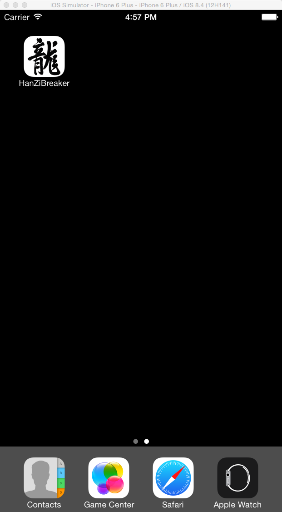
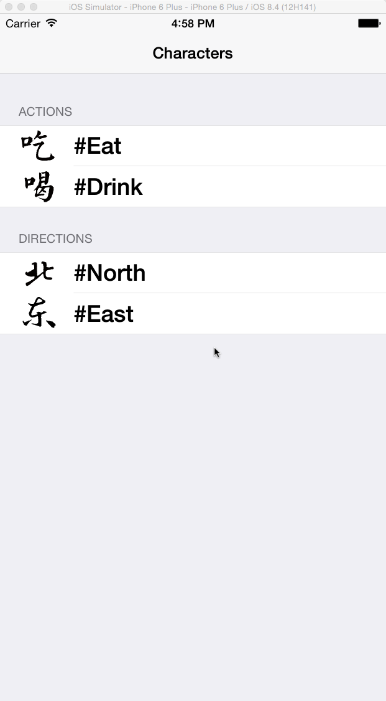
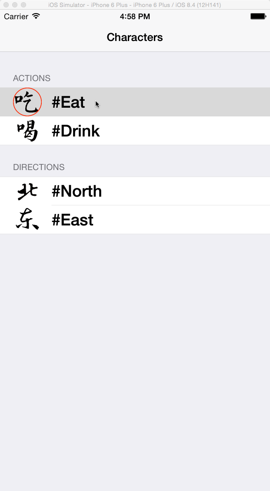
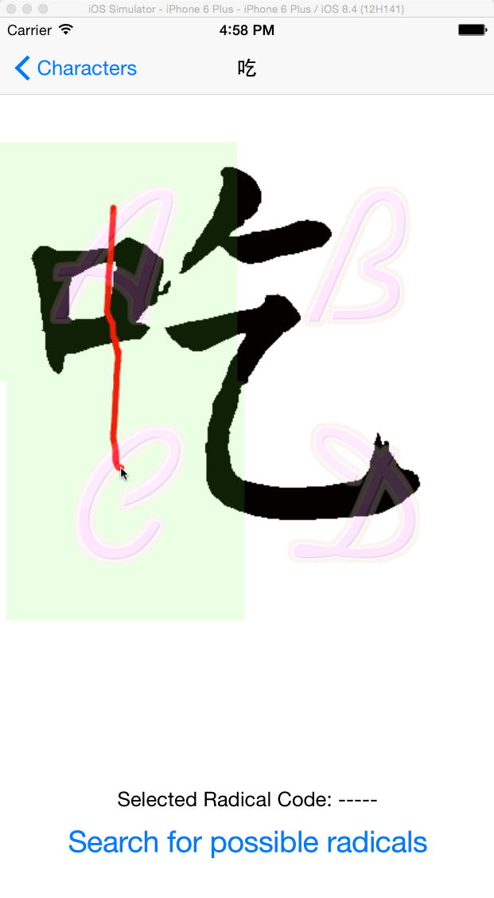
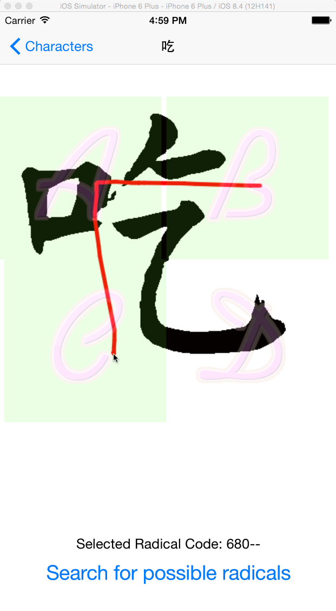
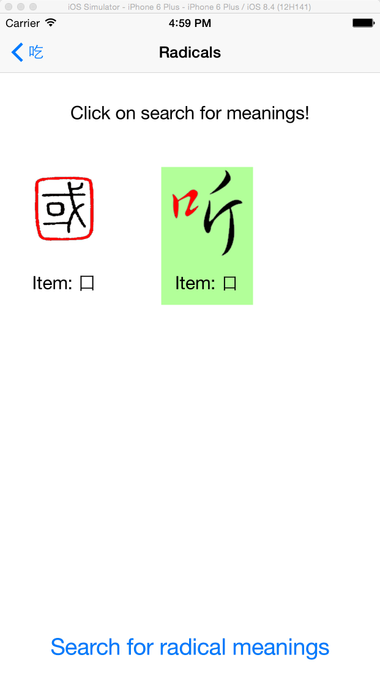
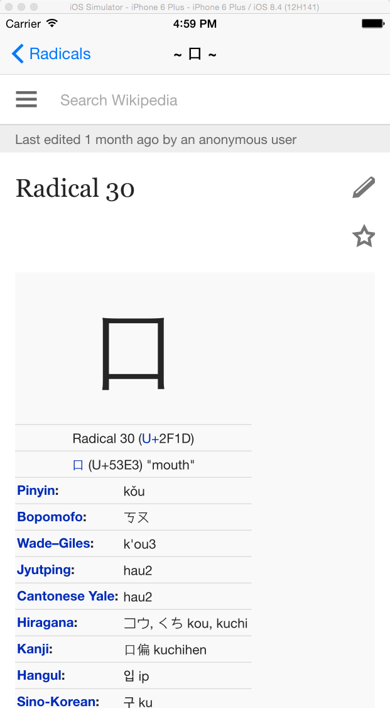
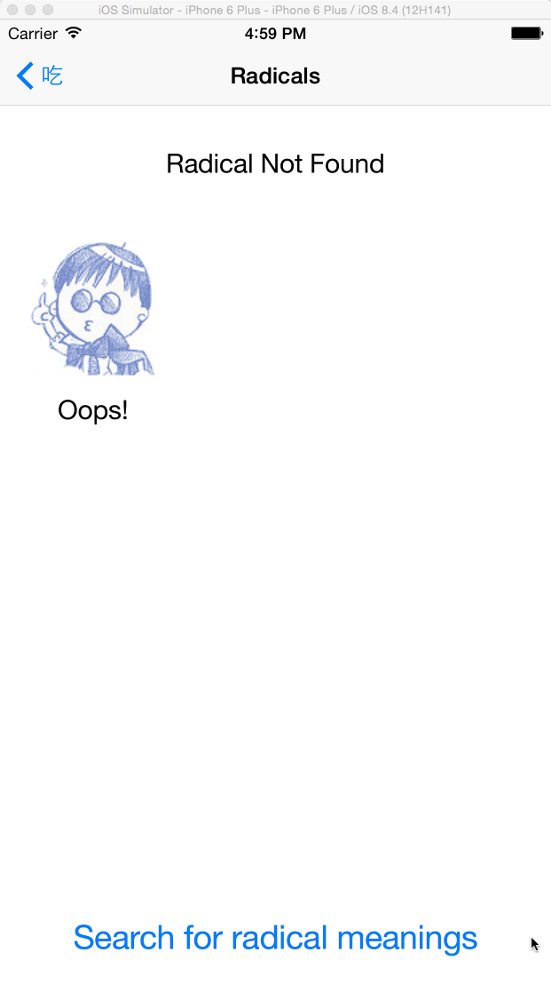
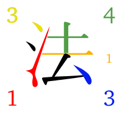

# Introduction
### App Goal
This App is build to help people to learn Chinese in a different way. It is more like a image recognizer as all we know the the Chinese characters are just some rule based pictures. 

### About Me
My name is He, Peng, short for HP. I’m a language lover and I want to introduce Chinese to the world not as the old way people did. I studied Ancient Chinese and Seal Character in high school, some Japanese and Korean in College time as an Engineering student. 

# The Han Zi Breaker
I’ll simply talk about how to use the App and some little detail  at the end.

### The App Icon
The Icon is the Character of “Dragon” written by [Kangxi Emperor](https://en.wikipedia.org/wiki/Kangxi_Emperor) simply represents the China

### Word Table
The word table is where user select what he wants to learn about. This page is built for now because the thing will replace it is a **Four Corner System** image recognizing algorithm. This algorithm is too hard to implement in the project without enough knowledge in Computer Vision. Please email me at [ThinkInBath@Gmail.com](ThinkInBath@Gmail.com) if you are interested in this in the further project.

The build-in contents are listed in different sections. Each section represents one category as shown in the demo picture.

When you select the table cell, the image will circle in red color.

### Draw To Select Radical(s)

According to **Four Corner System**, each corner of a character will represent a digit from 0 ~ 9, so there are four sections: A B C and D. The user can simply select which part of the word contains the radical he wants to learn about. Using his figure to touch over the radical part will highlight the selection and generate the **Four Corner System Radical Code** as shown below.

This picture shows that a user can select as many section as he wants with any drawing direction and the user can cancel the selection by just re-touch the screen.

### Possible Radical Choice(s)
The Four Corner Radical Code sometimes may represents not only one radical but as many as they satisfy the rule. This system is good because usual there are less than three possible radicals.

Now the user need to select the correct radical in the shown picture(s). The radical part(s) is highlighted in red color and comes with a Chinese character that contains it. When user touch the item section, the cell’s background will change to green.

### View More Information
For the last part, the App will guild the user to a website paper that explains the radical meaning. This paper is now temporally linked to Wiki.

# Additional Informations
### Item Not Found
If the sections user selected is not a radical or the radical is not yet supported in this version. A “Not Found Page” will be displayed. 

### [Four Corner System](https://en.wikipedia.org/wiki/Four-Corner_Method)
The Four-Corner Method (simplified Chinese: 四角号码检字法; traditional Chinese: 四角號碼檢字法; pinyin: sì jiǎo hàomǎ jiǎnzì fǎ; literally: “four corner code lookup-character method”) is a character-input method used for encoding Chinese characters into either a computer or a manual typewriter, using four or five numerical digits per character. The Four-Corner Method is also known as the Four-Corner System.

The four digits encode the shapes found in the four corners of the symbol, top-left to bottom-right. Although this does not uniquely identify a Chinese character, it leaves only a very short list of possibilities. A fifth digit can be added to describe an extra part above the bottom-right if necessary.

##### The Rule 
横一垂二三点捺，horizontal is 1, vertical 2, 3 is a dot;
叉四插五方框六，crossing is 4, crossing more than one is 5, a box is 6;
七角八八九是小，7 for a corner, 8 for 八 (shape of ‘8’ character), 9 is 小;
点下有横变零头。and a dot over a horizontal, or already another corner is 0.

